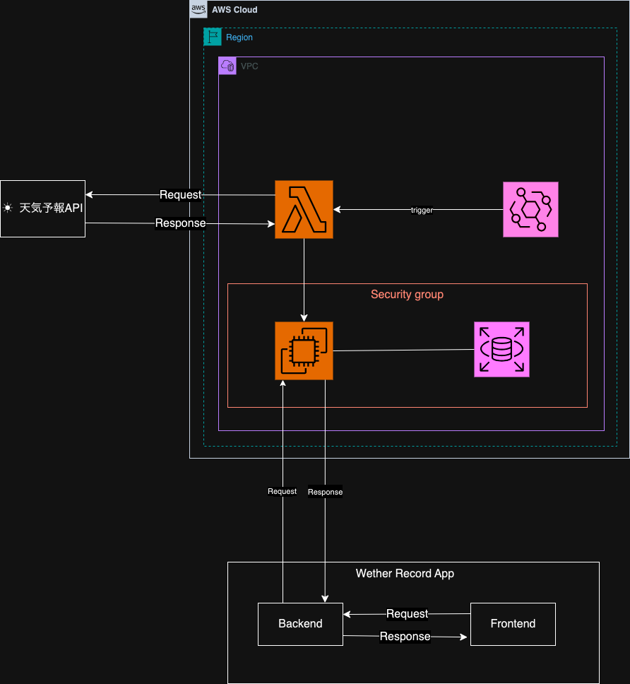
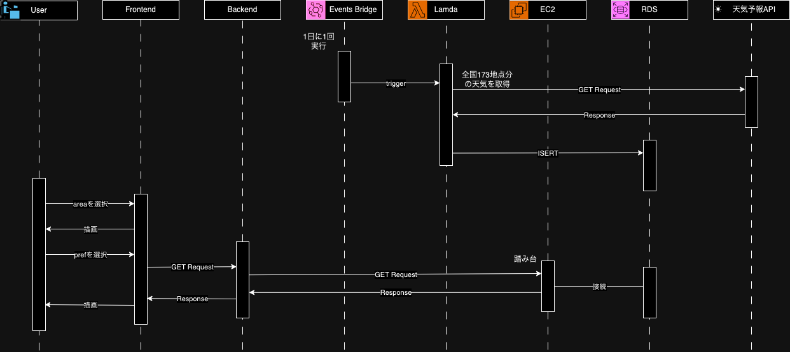
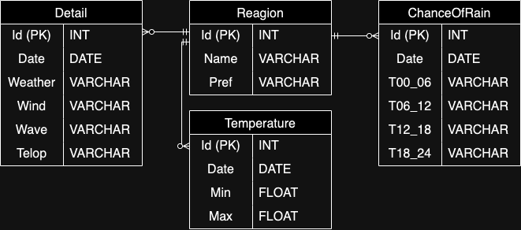

# weather-record

天気予報 API（livedoor 天気互換）を定期的に実行して RDS に、明日の天気予報のデータを書き込む。

## 使っている技術

- 使用言語
  - GO : `go version go1.21.5 darwin/amd64`
  - Python3 : `Python 3.8.8`(AWS SAM のインストールに使用)
- OSS
  - Docker : `4.21.1 (114176)`
- デベロッパーツール
  - AWS SAM : `SAM CLI, version 1.106.0`
  - AWS CLI : `aws-cli/2.15.8 Python/3.11.6 Darwin/23.2.0 exe/x86_64 prompt/off`
- 拡張機能
  - Toolkit for Visual Studio Code : `2.11.0`
  - GO : `v0.41.1`

## 開発環境の設定

### 前提条件

1.  AWS CLI のインストールと環境設定をする

    ```shell
    $ brew install awscli

    $ aws configure
    AWS Access Key ID [****************YPLL]:
    AWS Secret Access Key [****************gaRb]:
    Default region name [ap-northeast-1]:
    Default output format [None]:
    ```

2.  Python3 をインストールする  
    ここでは asdf というパッケージ管理ツールでインストール

    ```shell
    $ asdf plugin add python https://github.com/danhper/asdf-python.git
    $ asdf install python 3.8.8
    $ asdf local python 3.8.8
    $ pip install aws-sam-cli
    ```

3.  AWS SAM CLI のインストール

    ```shell
    $ brew tap aws/tap
    $ brew install aws-sam-cli
    ```

## デプロイ方法

1. Toolkit for Visual Studio Code をインストールする
2. Docker demon を起動する
   Docker Desktop から deamon を起動しても実行できます

   ```shell
   $ colima start
   ```

3. ローカルで Lamda を実行する
   ローカルの Lamda から EC2 経由で RDS に接続することができないです

   ```shell
   $ sam local invoke
   ```

4. ローカルで Lamda をデプロイする

   ```shell
   $ sam deploy
   ```

# 図説

## 物理構成図

AWS 内の物理構成図は下記のようになっています。
Backend と RDS 間、Lamda と RDS 間に EC2 を挟んでいるのは、直接 RDS に接続することができなかったためです。


## シーケンス図

シーケンス図は下記のようになっています。
全国 172 地点の`Id`は Lamda のディレクトリ内の json ファイルに持っています。

理想としては RDS の Reagion テーブル内の全てのレコードを取得するように変更を入れたい。

## ER 図

weather_record で使用する全てのテーブル情報を示します

